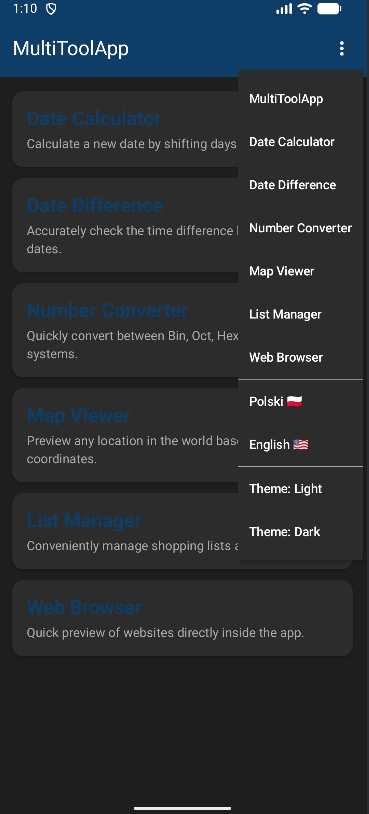
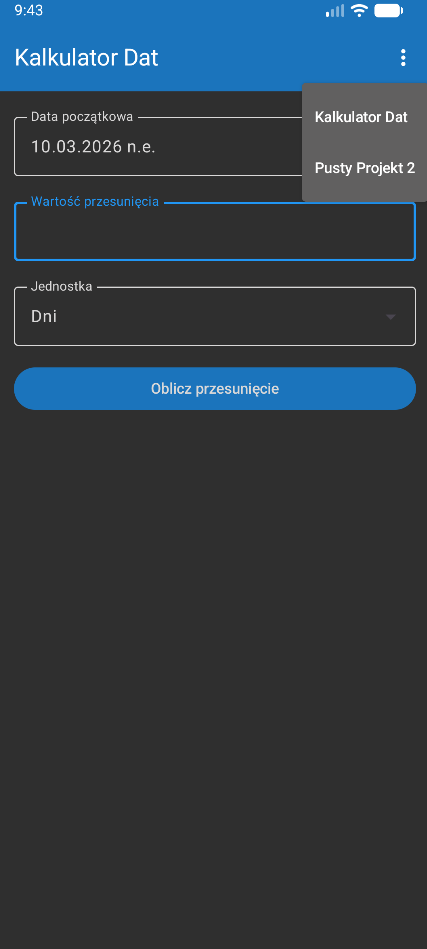
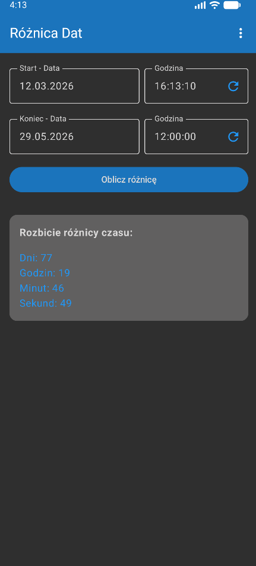
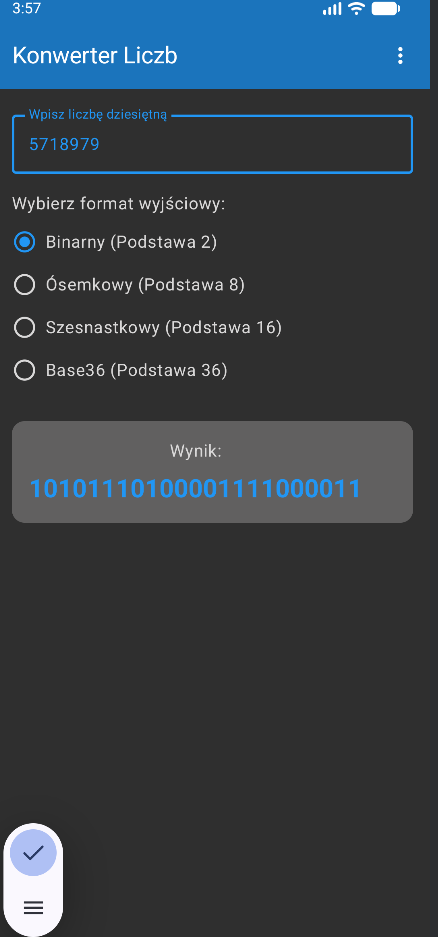
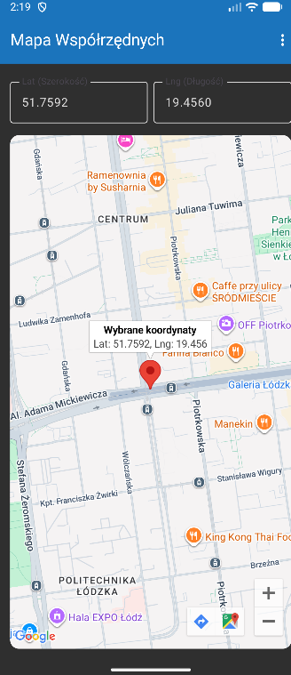
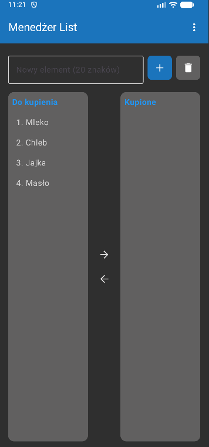
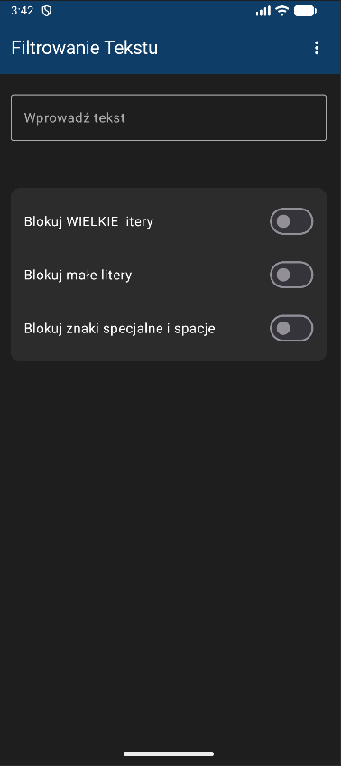
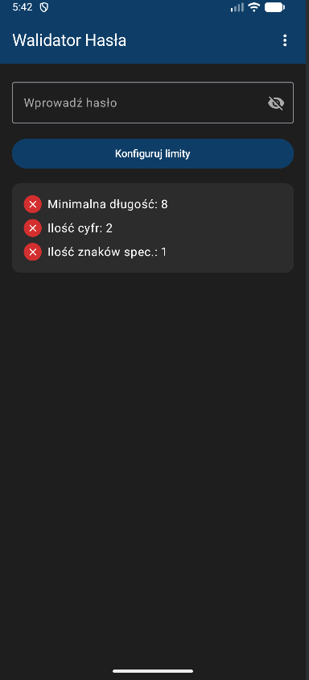
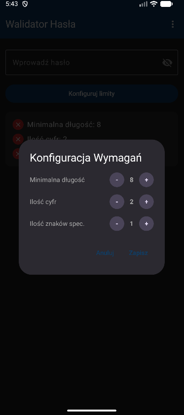

# MultiToolApp

A modular Android application built with Jetpack Compose, designed as a scalable container for various utility tools.

## Architecture & Infrastructure
The application has been refactored from a simple multi-screen setup into a production-ready product utilizing modern Android development standards.

* **UI Framework:** Jetpack Compose (Material Design 3).
* **Navigation:** `Jetpack Navigation Compose` (`NavHost`, `NavController`). Implements a true backstack, allowing intuitive hardware back-button navigation without unexpected app closures.
* **State Management (UDF):** Unidirectional Data Flow pattern implemented via `AndroidViewModel`. UI components are stateless representations of the ViewModel data.
* **Persistence:** Tools utilize `SharedPreferences` integrated directly into their ViewModels, ensuring critical user data (like active shopping lists or previous coordinates) survives process death and RAM clears.
* **Theming Engine:** Dynamic color scheme reacting to system preferences, with a manual override capability (Light/Dark/System) managed globally by a `MainViewModel` and `AppCompatDelegate`.
* **Internationalization (i18n):** Full support for English and Polish languages, switchable at runtime without restarting the application.
* **UX Polish:** Integrates the Android 12+ `SplashScreen` API for seamless app launches.
* **Minimum SDK:** 26 (Android 8.0) – required for native `java.time` API support.

## Included Modules

### 0. Home Dashboard
The central entry point of the application.

  <h3>Home Screen - Dark and Light Modes</h3>
  <table>
    <tr>
      <td></td>
      <td></td>
      </tr>
  </table>

* **Core:** A `LazyColumn` of interactive cards, acting as a structured routing hub.
* **UI/UX:** Replaces the jarring experience of launching directly into a specific tool. Provides localized titles and descriptions for every available module.

### 1. Date Shift Calculator

A utility to safely calculate past or future dates by adding or subtracting days, months, or years.
* **Core:** Driven by `java.time.LocalDate` and a native `DatePickerDialog`.
* **State & Persistence:** Backed by `DateCalculatorViewModel`, persisting the last configured date and shift unit.
* **Validation:** Implements strict input validation (limits shifts to +/- 100,000 units) to prevent `DateTimeException` crashes and UI overflow.
* **Formatting:** Era-aware formatting (BCE/CE via system `Locale`) to properly handle edge cases for large historical or future shifts.

### 2. Date Difference Calculator

A utility to calculate the exact absolute difference between two specific dates and times, breaking down the result into days, hours, minutes, and seconds.
* **Core:** Utilizes `java.time.LocalDateTime` and `java.time.Duration` for highly accurate, millisecond-level time math.
* **State & Persistence:** `DateDifferenceViewModel` securely stores all four parameters (two dates, two times) using ISO-8601 string parsing.
* **UI/UX:** Implements parallel `Row` structures combining `DatePickerDialog` and `TimePickerDialog`. Features a custom "Now" trailing icon button that captures the exact current system time.

### 3. Number Base Converter

A real-time decimal number converter demonstrating reactive state management in Jetpack Compose without explicit action buttons.
* **Core:** Utilizes Kotlin's native `toString(radix)` function to convert standard `Int32` numbers into Binary (Base2), Octal (Base8), Hexadecimal (Base16), and Alphanumeric Base36.
* **Validation:** Employs strict Regex filtering (`"^(0|-|-[1-9][0-9]{0,9}|[1-9][0-9]{0,9})$"`) directly on the input field to block leading zeros and limit string length.
* **UI/UX:** Uses `RadioButton` components inside a `selectableGroup`. The `onClick` events are elevated to the `Row` level to maximize the touch target area.

### 4. Map Coordinates Viewer

A geographic visualization tool that renders an interactive map based on user-provided coordinates.
* **Core:** Integrates the `com.google.maps.android:maps-compose` library for declarative UI map rendering. Uses `CameraPositionState` to smoothly animate the camera to the target location.
* **Validation & Normalization:** Latitude is clamped to `+/- 85.0511` to respect Web Mercator (EPSG:3857) rendering limits. Longitude utilizes modulo arithmetic (`((lng % 360) + 540) % 360 - 180`) to dynamically wrap around the globe.
* **Security:** The Google Maps API Key is securely injected during the build process via `local.properties` and Gradle's `manifestPlaceholders`.

### 5. List Transfer Manager

An interactive dual-list management system demonstrating advanced state handling and efficient list rendering.
* **Core:** Utilizes `mutableStateListOf` for reactive collections and `LazyColumn` for highly optimized, memory-efficient rendering.
* **Persistence:** High-priority persistence via `ListViewModel`. List states are serialized with custom delimiters and saved locally, ensuring shopping lists or task boards are never lost upon app termination.
* **State Management:** Implements a complex selection state using strong typing (`Pair<ListSide, Int>?`) to accurately track the active list and item index, dynamically controlling contextual actions.

### 6. In-App Web Browser

A lightweight, secure utility for previewing URLs without breaking user context or leaving the application.
* **Core:** Integrates the legacy `WebView` into Jetpack Compose via the `AndroidView` interop wrapper.
* **UX Safety:** Intercepts the system `BackHandler` exclusively when the WebView has a valid `canGoBack()` history, preventing accidental application exits while browsing deep document trees.

### 7. Text Filter

A secure text input field with dynamic character class blocking, demonstrating real-time input sanitization and complex state synchronization.
* **Core:** Utilizes Kotlin's native character evaluation (`isUpperCase()`, `isLowerCase()`, `isLetterOrDigit()`) for robust filtering that supports international character sets.
* **State & Persistence:** Backed by `TextFilterViewModel`, which preserves both the input string and the state of the toggle switches across process death via `SharedPreferences`.
* **UX Polish:** Implements active retroactive filtering. Toggling a restriction switch immediately sanitizes existing text and surfaces context-aware error messages to explain the destructive action to the user. Built-in mechanisms prevent UI "state bounce" during invalid keystrokes.

### 8. Password Validator

  <table>
    <tr>
      <td></td>
      <td></td>
    </tr>
  </table>

A real-time password strength validator with dynamically configurable requirement thresholds.
* **Core & Security:** Utilizes `KeyboardType.Password` to prevent the OS keyboard from learning inputs via dictionary caching, alongside dynamic `PasswordVisualTransformation` for a standard visibility toggle.
* **State Management:** The `PasswordViewModel` strictly separates persistent configuration limits (saved via `SharedPreferences`) from the volatile password input string, ensuring sensitive keystrokes are never written to local storage.
* **UI/UX:** Features a reactive checklist that provides instant visual feedback (color and icon state shifts) evaluated in real-time as the user types.
* **Robust Configuration:** The requirements dialog avoids raw text inputs entirely. By using custom Stepper controls (+/- buttons) with hardcoded min/max boundaries, the architecture physically prevents `NumberFormatException` crashes, out-of-bounds states, and malicious clipboard pastes. It also utilizes isolated temporary states to allow safe cancellation of ongoing edits.
